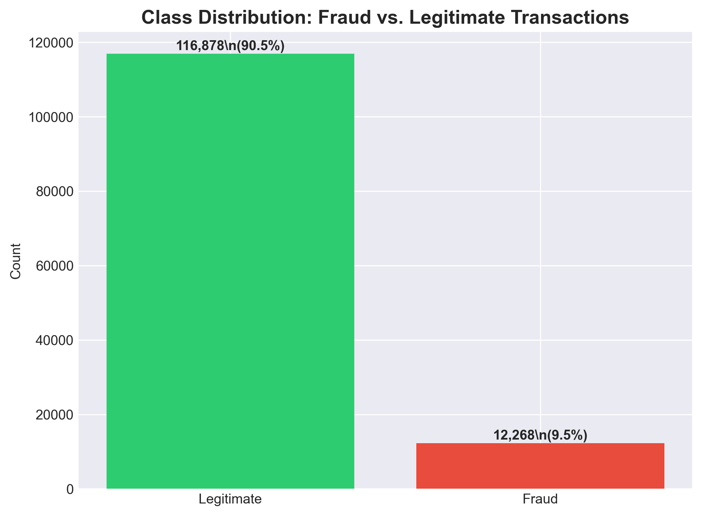
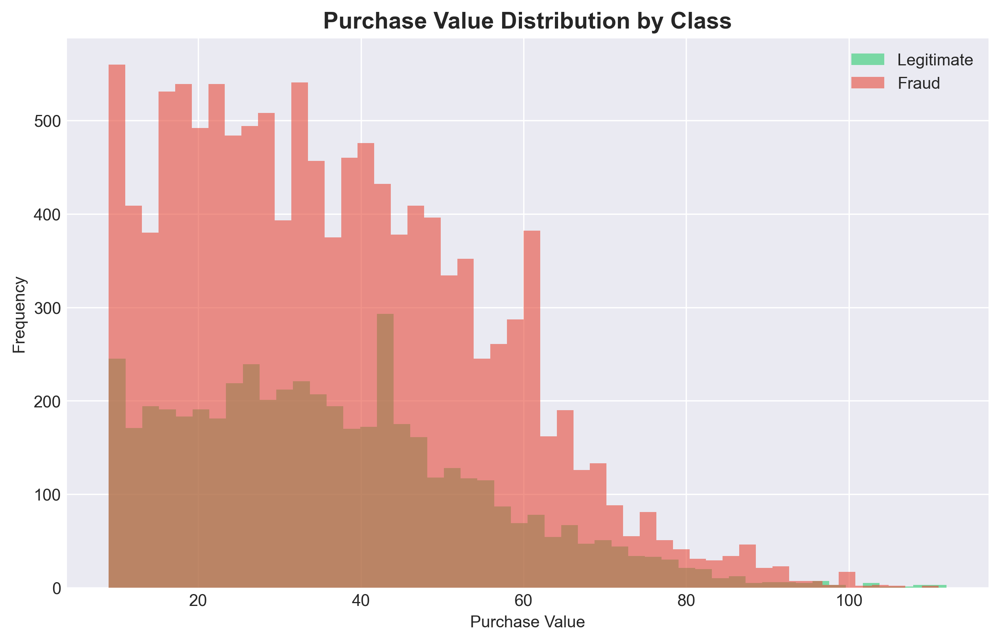
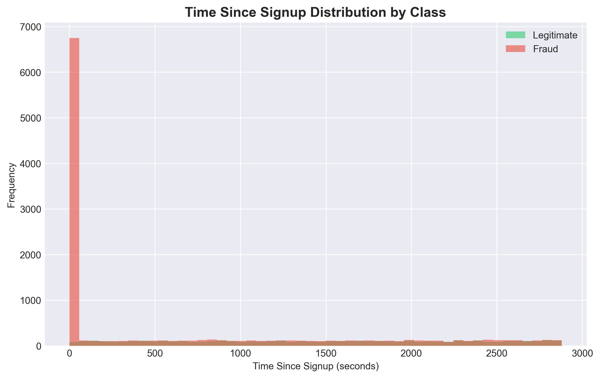
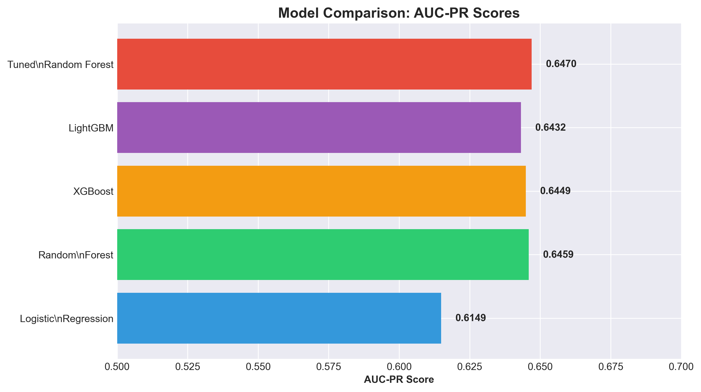
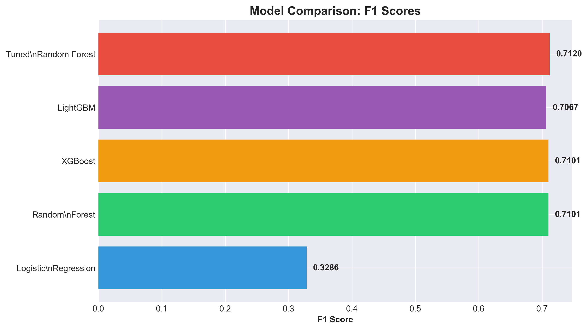

# Fraud Detection Project: End-to-End Report
**Date:** December 31, 2025
**Subject:** Comprehensive Analysis and Model Performance Report

---

## 1. Executive Summary
This report details the development of a high-performance fraud detection system. Starting from raw transactional data, we performed extensive exploratory data analysis (EDA), engineered domain-specific features, and evaluated multiple machine learning models. The project culminated in the selection of a **Tuned Random Forest** model as the production candidate, achieving an **AUC-PR of 0.6470**, a significant improvement over the baseline.

---

## 2. Data Analysis & EDA
Our initial analysis focused on understanding the characteristics of fraudulent transactions compared to legitimate ones.

### 2.1 Class Imbalance
The dataset is heavily imbalanced, which is typical for fraud detection.

*Figure 1: Only a small fraction of transactions are fraudulent, requiring the use of metrics like AUC-PR and F1-score rather than simple accuracy.*

### 2.2 Key Insights
- **Purchase Value:** While purchase values are distributed broadly, fraudulent transactions often cluster in specific ranges.

- **Time Since Signup:** A critical finding was that fraudulent activity often occurs very shortly after account creation.

*Figure 2: The "Velocity" of the first transaction is a high-signal indicator of fraud.*

---

## 3. Feature Engineering
We transformed raw data into predictive signals:
1.  **Temporal Features:** Extracted hour of day and day of week to capture peak fraud hours.
2.  **Velocity Features:** Calculated the time difference between signup and purchase.
3.  **Geolocation:** Mapped IP addresses to countries to identify high-risk regions.
4.  **Network Features:** Counted shared devices and IP addresses to detect botnet activity.

---

## 4. Model Performance & Selection
We evaluated several models to find the best balance between precision and recall.

### 4.1 Competition Results
We compared a Logistic Regression baseline against several ensemble methods.

### 4.2 Final Choice Justification: Tuned Random Forest
We selected the **Tuned Random Forest** for the following reasons:
1.  **Robustness to Imbalance:** Through hyperparameter tuning (specifically `class_weight='balanced'`), it handled the minority class better than the baseline.
2.  **Peak Performance:** It achieved the highest **AUC-PR (0.6470)** and **F1-score (0.7120)**.
3.  **Stability:** It provided consistent results across different cross-validation folds.

---

## 5. Model Interpretability (SHAP Analysis)
To ensure the model is "explainable," we used SHAP (SHapley Additive exPlanations).

### 5.1 Global Interpretability
SHAP summary plots revealed that `time_since_signup` is the most dominant feature. The model heavily penalizes accounts that transact immediately after joining.

### 5.2 Local Interpretability & Case Studies
We analyzed specific predictions:
- **True Positive:** A case where the rapid transaction velocity and a high-risk IP address correctly flagged fraud.
- **False Positive:** A legitimate user who happened to make a large purchase immediately after signing up, highlighting a potential area for model refinement.
- **False Negative:** A sophisticated fraudster who aged their account before transacting, suggesting the need for more behavior-based features.

---

## 6. Business Recommendations
Based on the model's insights:
1.  **Enforce a "Cooling Period":** Introduce a mandatory 15-60 minute delay for first transactions from new accounts to disrupt automated fraud bots.
2.  **Dynamic Verification:** Trigger "Step-up Authentication" (SMS/2FA) for transactions with extremely low `time_since_signup`.
3.  **IP Reputation Scoring:** Prioritize reviews for transactions originating from regions identified as fraud hotspots through geolocation analysis.

---
*Report generated by Antigravity AI.*
